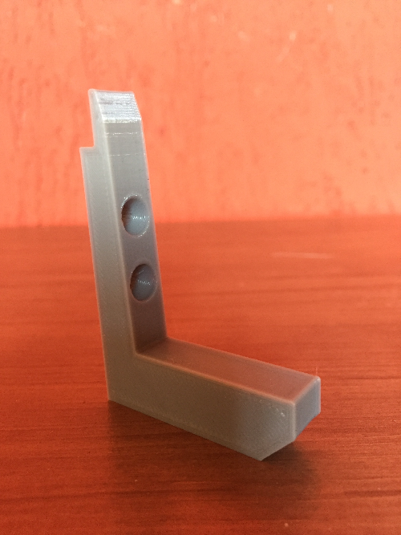
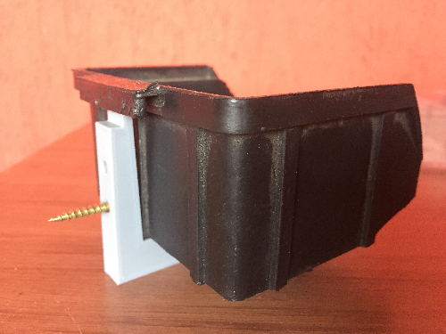
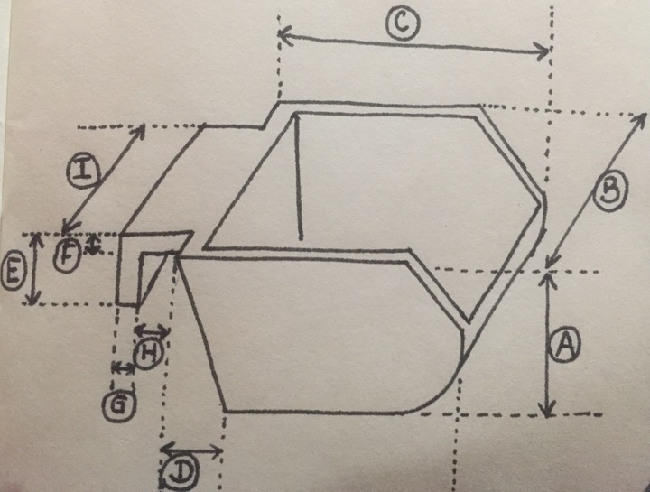
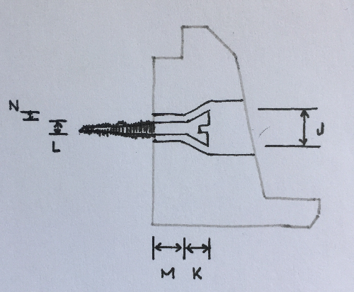
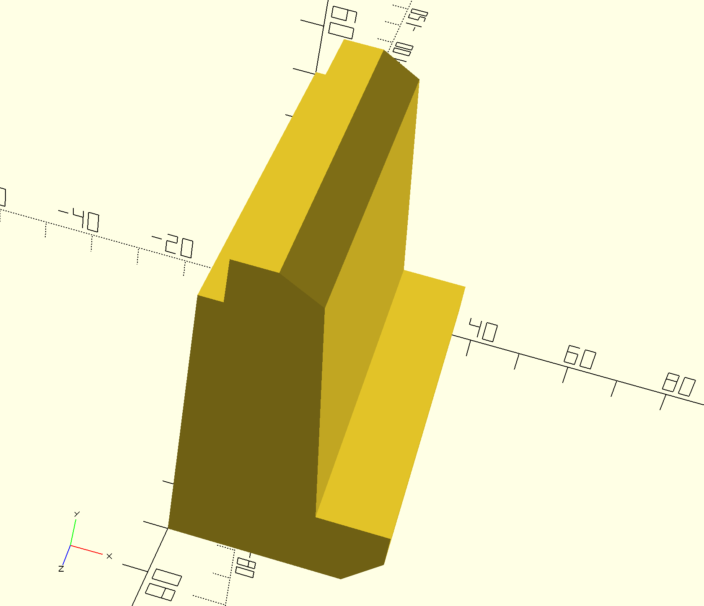

# Parametric Bin Holder

https://www.thingiverse.com/thing:4923121

https://github.com/lexblagus/ParametricBinHolder

## Summary

Holder support for Marfinite™ standard bins or equivalent with inverted L shape in the holding chanfer.

## Parameters

### Bin

- A: `binHeight`;
- B: `binWidth`;
- C: `binLength`;
- D: `binLengthBackFloorOffset`;
- E: `binChanferHeight`;
- F: `binChanferHeightThickness`;
- G: `binChanferLengthThickness`;
- H: `binChanferLengthInternal`;
- I: `binChanferWidth`;

### Screws

- J: `screwHeadDiameter`;
- K: `screwHeadHeight`: 0 for flat head, > 0 for conical;
- L: `screwShankDiameter`;
- M: `screwShankLength`;
- N: `screwSpacing`;
- `screwQuantity`;

## Generator

At folder `generator` you can find the script to generate several files at once (tested on MacOS only):

- Edit `const templates` at `generator/index.js` as you wish
- Run `cd generator` then `./run.sh` to generate files.

The measurements for the oficial sizes are not corret yet, this is a work in progress.

## Examples

