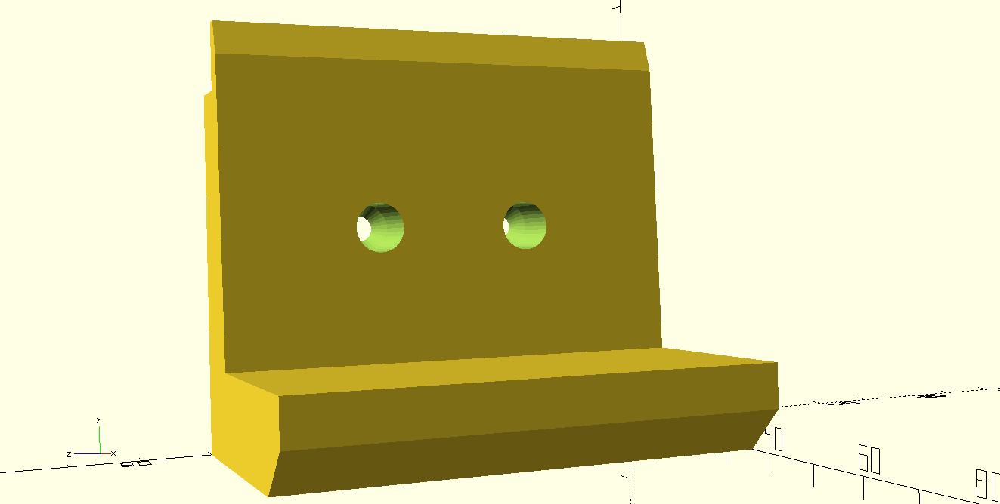

# Parametric Organizer

https://www.thingiverse.com/thing:___

https://github.com/lexblagus/Parametric___

## Summary

Holder support for Marfinite™ standard bins or equivalent with inverted L shape in the holding chanfer.

## Parameters

- A: `binHeight`;
- B: `binWidth`;
- C: `binLength`;
- D: `binLengthBackFloorOffset`;
- E: `binChanferHeight`;
- F: `binChanferHeightThickness`;
- G: `binChanferLengthThickness`;
- H: `binChanferLengthInternal`;
- I: `binChanferWidth`;

## Generator

At folder `generator` you can find the script to generate several files at once (Mac users only by now):

- Edit `const templates` at `generator/index.js` as you wish
- Run `cd generator` then `./run.sh` to generate files.

## Examples

I did not print anyone yet (hello world!). This is the piece aligned with the previous image:

This is the slicing example for models 3 to 6:

## To do

- Holes
